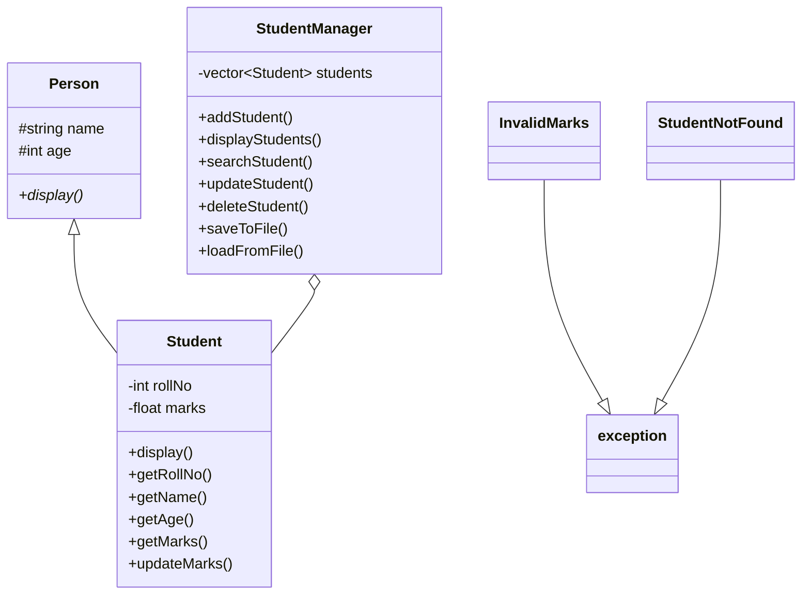

# UML Class Diagram

```mermaid
classDiagram
    class Person {
        #string name
        #int age
        +display()*
    }

    class Student {
        -int rollNo
        -float marks
        +display()
        +getRollNo()
        +getName()
        +getAge()
        +getMarks()
        +updateMarks()
    }

    class StudentManager {
        -vector~Student~ students
        +addStudent()
        +displayStudents()
        +searchStudent()
        +updateStudent()
        +deleteStudent()
        +saveToFile()
        +loadFromFile()
    }

    class InvalidMarks
    class StudentNotFound

    Person <|-- Student
    StudentManager o-- Student
    InvalidMarks --|> exception
    StudentNotFound --|> exception
```
